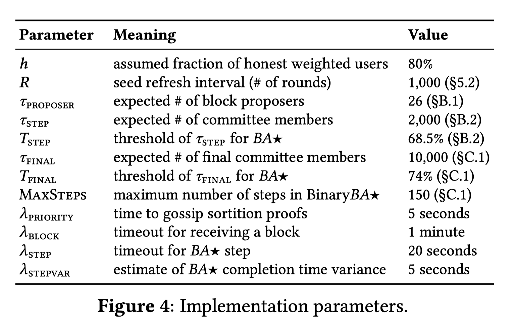
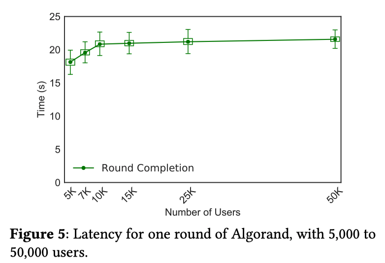
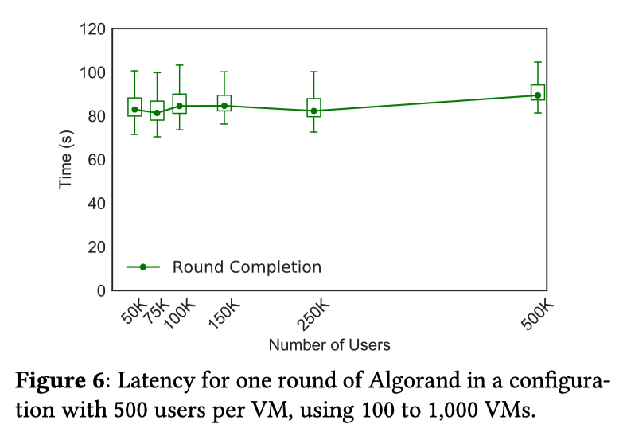
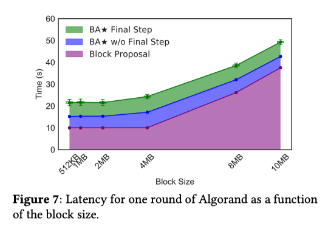
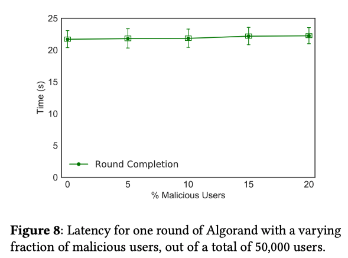

# Algorand剖析

> Algorand是由图灵奖获得者Silvio Micali发明的一种加密货币共识算法。该算法通过加密抽签缩小共识节点数量，从而实现了拜占庭共识算法的大规模场景扩展，解决了过去拜占庭容错相关算法无法拓展至大规模节点场景的问题。

本文主要基于论文[gilad-algorand-eprint](https://people.csail.mit.edu/nickolai/papers/gilad-algorand-eprint.pdf)剖析。

## 关键概念

1. **VRF**: 可验证随机函数。简单来说是：`VRF,Proof = VRF(sk,seed)`，`sk`为私钥，`seed`为随机种子；通过`Verify(proof,pk,seed)`验证`vrf`的合法性。
2. **cryptographic sorition**: 根据用户本轮的VRF值，自身的权重以及公开的区块链信息，计算出某用户本轮被选举的`sub-users`个数，并提供相应的证明。
3. **committee member**: 见证人委员会，即使用`cryptographic sortition`选举出的用户集合。
4. **FINAL**共识：全网用户对某一非空块达成了共识。`FINAL`区块及之前区块所包含的交易均被确认。
5. **TENTATIVE**共识：其他用户**可能**对不同的区块达成了共识。`TENTATIVE`区块的交易需要在对之后的`FINAL`区块达成共识后得到确认。

## 基本假设

1. 诚实用户运行bug-free的软件。
2. 诚实节点所持Token的总数占比大于`2/3`，以避免区块**分叉**与**交易双花**。
3. **强同步(strong synchrony)假设**：大多数诚实用户（例如95%）发送的信息都能在一定的已知的时间范围内，被大多数诚实的用户接收。
4. **弱同步(weak synchrony)假设**：网络在一定的长时间内是异步的（例如完全被恶意方控制）。在异步阶段之后，网络一定会有一段合理时长的**强同步**阶段，在这一阶段，Algorand可以确保算法安全。在此情况下，算法仍然安全但性能会受较大影响。
5. **强同步时钟**：为了在弱同步情况下执行**恢复协议**，所有节点需要同步本地时钟，即本地时钟应当足够接近，使得所有节点执行恢复协议的步调基本一致。

## 核心算法
Algorand的核心算法流程主要分为三部分：

1. 密码学抽签算法。
2. 区块提案。
3. BA*算法。

### 1. 加密选举
下图为选举算法的伪代码。入参解释如下：

- `sk`: 用户私钥。
- `seed`: 选举所用的种子信息。
- `τ`: 期望选举的子用户`sub-users`数量。
- `w`: 用户的权重。
- `W`: 全网总权重。

算法细节解释具体见论文5.1节。

为了防止女巫攻击，Algorand使用二项分布作为概率分布函数，原因是`B(k1+k2;w1+w2,p) = B(k1;w1,p) + B(k2;w2,p)`，即从概率上来说，无法通过拆分token来提高被选中子用户的数量。

某用户的子用户数量`j`数量大于0，即表示该用户被选为`committee member`。

#### 选举验证
选举证明算法如下，用于判断某用户的VRF值是否合法，且在当前轮次与步骤下是否被选举为`committee member`。该函数在`CommitteeVote`中被使用到。

#### 如何选取种子
在Algorand中，`seed`作为区块的一个字段，第r轮的seed由第r-1轮区块的seed所决定，计算公式如下:

`<seed(r),π> = VRF(sk,seed(r−1)||r)`.

为了限制攻击者操纵选举的能力，选举算法中所用的seed会每隔R轮刷新一次，即`seed(r) = seed(r-1-(r mod R))`。

#### 选择早先于`seed`的私钥
上述机制对用户的私钥`sk`选择提出了新的要求：由于`seed`在固定R轮中不变，这使得恶意用户可以通过尝试不同私钥来控制VRF值。Algorand要求用户的私钥是在区块r-1-(r mod R)之前生成的，论文中提出的方案是使用距离区块r-1-(r mod R)早`b`个时间单位的最近区块所使用的密钥对。

### 2. 区块提案
区块提案阶段主要做以下两件事：

1. 判断是否选举为提案者。若是，则提案自己的区块，并广播两种消息`Proposal`（通常200字节)与`Entire Block`（通常1MB字节以上）。这么做是为了加速**优先级信息**在网络中的传播速度，降低带宽开销。若否则跳过该步骤。

2. 等待`λstepvar+λpriority`的时间，收集足够的提案信息，并定位最高优先级的区块提案，并继续监听网络直到收到该优先级对应的区块（设置超时时间为`λblock`）。若超时则提空块。

#### Q&A
Q: 步骤2中为何将等待时间设置为`λstepvar+λpriority`？

A: 当某个提案者已经能够在第r轮提出一个区块时，其他用户可能还在第r-1轮的BA*过程。由于大多数用户最多相差该用户1个step，因此最差情况是在做`BA*`的最后一步。因此为了尽可能多地接收到其他节点的提案消息，`Proposal`的等待时间应当设为`一个step的预计时间 + Proposal的预计传播时间`。

### 3. 执行BA*共识

BA*共识又被细化为两个重要的子算法：

#### Reduction 

在`Block Proposal`阶段，不同的诚实节点因为网络延迟等因素，会收集到不同优先级的区块，其所观察到的最高优先级区块可能不同。因此，它们传入**BA***算法的区块也会不同。因此在做拜占庭共识之前，先执行**Reduction**，在全网对**哪个区块的优先级最高**这一问题进行投票并达成共识，将N个潜在的区块收敛为**至多1个非空区块**。具体分为2步：

1. 检查自己是否为`committee member`，若是则对自己提案的区块投票。
2. 等待`λblock + λstep`的超时时间，收集网络用户的投票。
3. 一旦某区块的投票数超过了`T*τ`的阈值，则认为全网大部分诚实节点在该区块达成共识，再对该区块投票；若步骤2超时，则对空块投票。
4. 等待`λstep`的超时时间，收集网络用户投票，并返回最终得到的区块。

##### Q&A

Q：为什么要进行两次投票？

A：第一次投票（步骤2）用于对大多数节点所看到的最高优先级区块达成共识，类似于`prepare`阶段；第二次投票（步骤3、4）用于对第一次投票的共识结果进行共识，表示大多数节点已经对某新区块达成共识，类似于`commit`阶段。

Q：`CommitteeVote`函数中为何要传入不同的`step`？（`REDUCTION_ONE`与`REDUCTION_TWO`）

A：每个用户的`vrf`值，`round`和`step`均为选举算法的随机种子，影响着用户是否能被选举为`committee member`。这里对**Reduction**的两次投票引入了一定的随机性，使得两次投票的用户不同。若两次投票用户均为同一批，恶意方可以在两次投票之间的时间间隙，对第一次投票的用户进行攻击（因为第一次投票后已经暴露了投票人是谁），从而危及算法安全性。

#### BinaryBA*
BinaryBA\* 算法对Reduction过程收敛的区块进行多次投票，在网络状况靓号的情况下在第一步即可达成`FINAL`共识。

1. step=1时，用户对Reduction得到的区块hash进行投票，并收集票数。若超时，则保持原区块hash，进入步骤2；若不超时且投票结果为非空块，则再对该hash投票3次，并投出`FINAL`步骤的票（意为当前用户已达成`FINAL`共识），返回该区块hash。

2. 继续对上一步骤中得到的区块hash投票并收集票数。若超时，则将hash置为空块hash，并进行步骤3；若得到空块，则连续投票3次并返回空块hash。

3. 继续对上一步骤中得到的区块hash投票并收集票数。若超时，则执行“抛硬币”算法，有50%的概率将hash置为原先的区块hash或空块hash。若否，则将hash置为投票结果。最后重复步骤1。

##### Q&A
Q: 在每轮算法的前两步中达成共识，为何在return之前要连续投票3次？

A: 在公网环境下，若有很多诚实节点在某一步达成共识并返回，而其余诚实节点由于网络延迟，在给定时间内没有收集到足够的票数，从而超时进入下一轮。此时在接下来的step中很可能没有足够的`committee member`进行投票，使得这些节点始终无法对区块达成共识。Algorand对这一问题的解决方案是：在某用户达成共识并结束算法之前，预先对该区块hash进行**后三步**的投票。在还未达成共识的用户看来，这些已达成共识的节点仍然参与了后三步（后一轮）的投票。

Q: 为何设计`CommonCoin`抛硬币算法？

A: 根据`CommonCoin`的算法特性，诚实用户的比例最坏为`2/3`，经过`CommonCoin`得到`block_hash`和`empty_hash`概率均为为`1/2`，因此每经过一次`CommonCoin`，全网达成共识的概率为`(2/3)*(1/2) = 1/3`。则全网用户在第i轮达成共识的概率为`((2/3)^(i-1))*(1/3)`。达成共识的期望总轮数为`i*((2/3)^(n-1)*(1/3))`的无穷级数，即极限为3。因此，**通过抛硬币，在最坏情况下，全网达成共识的期望轮数为3，期望步骤数为`2+3*3=11`**

### 4. 分叉解决

Algorand的分叉解决采取**定期解决**的方案，基于**最长链**原则。主要流程与正常的共识流程相似：分叉提案者提出一个空块，其父区块为自身所观察到的最长链的区块头。依次执行`Block Proposal`与`BA*`流程，得到全网共识的分叉块，从而完成分叉链的选择。

为了能够准确地进行分叉解决，在正常的共识流程中，每个用户也需要追踪不同的可能的分叉链。

由于临时分叉的存在，为保证正常的共识流程中，全网用户都使用相同的seed进行新一轮的共识，对于seed(r-1-(r mod R))中的R也需要做谨慎的选取。

## 算法细节解析

### 算法辅助函数

#### CommonCoin

CommonCoin算法用于模拟`1/2`概率，俗称”抛硬币“，但该”抛硬币“算法有以下两个特点：

1. 结果只有2个，且每个结果的概率为50%。
2. 使用相同参数作为种子，获得的结果相同。

在Algorand中，CommonCoin使用全网的投票信息作为种子，对于强同步的大多数诚实节点来说，得到相同结果的概率为`h`（`h`即为诚实节点所占比例，`h > 2/3`）。故每经过一次CommonCoin可以`h`的概率让大多数诚实节点达成共识。

#### CountVotes
CountVotes算法用于在给定时间内统计票数，并选出超过票数阈值的合法区块。每个投票消息的票数实际为**该用户在当前上下文中所选举的子用户数量**。

#### ProcessMsg
ProcessMsg用于接收投票信息，验证并统计票数。

## 模拟结果

在论文实现的版本中，各参数的选取值如下：

模拟结果在论文第10节中有详细描述，在本文对Algorand模拟评估结果做简要归纳：

1. 交易确认的延迟？当用户规模扩大时延迟如何增长？
2. 每秒交易吞吐量？
3. CPU，带宽与存储的开销？
4. 当有恶意节点时，Algorand表现如何？

评估解答如下——

### 延迟 (10.1节) 
Figure 5显示了随着用户总数的增加，每轮的完成时间趋于稳定值。这表明Algorand算法能够在大规模节点数量场景下保持共识的稳定。

Figure 6将单机用户数增加到500个，使用相同时长的sleep来模拟验签过程（为了不过度消耗CPU），并将`λstep`提高至1分钟。结果显示随着节点规模的增加，每轮耗时趋于稳定。

### 交易吞吐量 (10.2节)
Algorand团队部署了50000个用户在1000台VM上。

图中的三个指标含义如下:

- Block Proposal: 完成区块提案阶段所使用的时间。
- BA* w/o Final Step: BA*算法进行到`FINAL` step所使用的时间。
- BA* Final Step: BA*算法完成`FINAL` step所使用的时间。

结果表明: 区块大小仅仅影响Block Proposal阶段的区块广博。BA\*阶段的共识时间几乎不受区块大小的影响。（原因是BA\*阶段仅对区块hash进行投票）

### 资源开销 (10.3节)
Algorand论文所模拟的版本，其资源开销如下：

- CPU开销
	- 每个VM（8核CPU）运行50个用户节点。
	- CPU使用率大约40%。大部分开销在验签与验证VRF。
	- 每个Algorand进程使用一个核的6.5%。
- 带宽开销
	- 区块大小1MB，50000个用户的gossip广播的带宽达到10Mb/s。
	- 由于Gossip算法性质，每个用户所广播的远端用户数量是一定的。同时，全网的消息总量受`committee member`数量的影响，而非总用户数量。因此，**带宽开销仅受到区块大小和委员会成员数量的影响**。
- 存储开销
	- 区块凭证大约300KB，独立于区块自身大小。（ps: 区块凭证用于向新用户证明该区块已被提交入链）
	- 在用户中分片存储区块凭证可以降低开销。（但这也降低了凭证数据的可靠性）

### 恶意节点 (10.4节)
模拟所有的恶意节点行为是不可能的，Algorand论文中所模拟的恶意节点行为是：强迫最高优先级的区块提案者向两个不同的用户组广播不同版本的区块（当某诚实用户收到来自最高优先级提案者的两个不同区块时，它会同时丢弃并使用一个空块进入BA\*）。同时，被选举为`committee member`的恶意用户也会同时对两个区块进行投票。

下图显示了在恶意用户比例小于`1/3`的前提下，该攻击方式并不能显著影响算法性能。

## 存在的问题
1. 每轮共识无固定时间间隔，考虑到网络延迟及用户的硬件配置不同，如何保证每个节点执行共识流程的步调一致？
2. 论文并没有对每一轮达成`FINAL`或`TENTATIVE`共识后的后续流程做阐述，这里引申出两个问题：
	- 如何标记该轮共识区块是`FINAL`还是`TENTATIVE`。
	- 达成`TENTATIVE`共识后是否需要额外的流程？（如进行快速的分叉检查？）
3. 每一步投票中，`committee memer`的选举都受到step的影响，这要求sortition算法对各种子参数都具有较为稳定且宽松的结果输出，以避免频繁出现票数总数达不到阈值`T*τ`的情况。
4. 共识流程中多个阶段需要预估超时时间，这对于运行耗时不确定的智能合约的场景来说非常不合适。因此Alogrand目前的算法仅适用于加密货币。
5. 算法性能受到网络连通性的影响。
6. VRF算法的安全性问题。